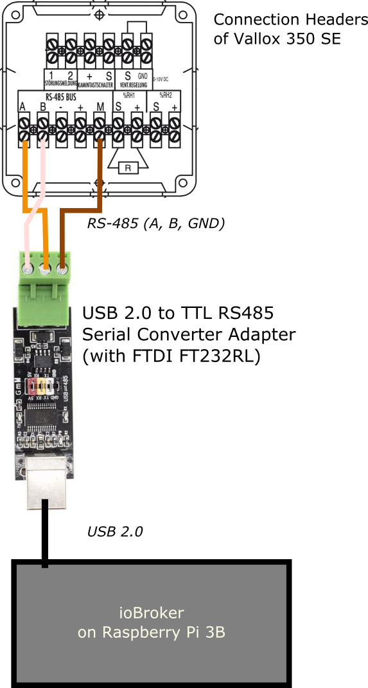

# ioBroker.valloxSerial


[](https://www.npmjs.com/package/iobroker.valloxserial)

[](https://david-dm.org/hacki11/iobroker.valloxmv)
[](https://snyk.io/test/github/mld18/ioBroker.valloxserial)


[](https://nodei.co/npm/iobroker.valloxserial/)

<!--
Think about these badges later on...
[](https://www.npmjs.com/package/iobroker.valloxserial)

[](https://travis-ci.org/hacki11/ioBroker.valloxmv)
-->


## Disclaimer
For this adapter development has just started. Please don't use it and don't file any issues yet.
Stay tuned...


## Description
This is an [ioBroker](http://iobroker.net) adapter. It is used to read settings and data as well as to change settings of Vallox ventilation units of type SE. I.e., units that are controlled electronically via the legacy Vallox RS-485 serial protocol.

If you are looking for an adapter for a Vallox MV unit, please refer to [ioBroker.valloxmv](https://github.com/hacki11/ioBroker.valloxmv).

# Warning
This adapter is provided 'as is' with no guarantee of proper function. Use at own risk. 

## Supported (tested) Units
I'm developing and testing this adapter with my Vallox ventilation unit which is a **Vallox 350 SE**. Beside the main unit there is one wired control unit (FBD 382 LCD).

The adapter might work with similar units. Provided the serial protocol is the same.

## Hardware and Wiring

### RS-485 Connection
Vallox units with a legacy electronic control employ a 5-wire RS-485 bus. "RS-485 does not define a communication protocol; merely an electrical interface." (Source: [Wikipedia](https://en.wikipedia.org/wiki/RS-485)).


| Wire  | Color     | Meaning        |
| ----- |-----------|----------------|
| A     | orange 2  | RS-485: A      |
| B     | white 2   | RS-485: B      |
| -     | white 1   | - of 21 VDC power supply for Vallox devices |
| +     | orange 1  | + of 21 VDC power supply for Vallox devices |
| M     | metal     | RS-485: Ground |
(Source: [Vallox KWL Digit SE/SE VKL Technische Anleitung](https://vallox.de/Downloads/Archiv/digitSE/DIGIT-SE-Technik_f092003.pdf))

### Wiring
There are 485 to TTL to USB converter with a FTDI FT323RL chip available that make wiring very easy and straight forward.


### Driver Install on Raspberry Pi / Linux
This [video](https://youtu.be/DXgvaibDJzo) shows how to install the RS-485 to USB converter with the FT232 chip under Linux (and therefore, for Raspbian).
1. Plug in the converter
2. `lsusb | grep FT232` for a list of USB devices (for me the entry looked like ```Bus 001 Device 006: ID 0403:6001 Future Technology Devices International, Ltd FT232 USB-Serial (UART) IC``` the colon separated numbers are the vendor and the product IDs repectively).
3.  `modprobe usbserial vendor=0x0403 product=0x6001` (with my vendor and product ID from `lsusb`)
4. Check with `dmesg | grep ttyUSB` (should tell you that there's a FTDI device attached to ttyUSB)
5. Make interface public: `chmod 777 /dev/ttyUSB0`
6. Check if ttyUSB0 is set to serial config of 9600,N,8,1 (9600 bauds, no stopbit, 8 data bits, 1 stop bit): `stty -a -F /dev/ttyUSB0` or just set it `stty -F /dev/ttyUSB0 9600 cs8 min 1 ixon -cstopb -parenb -echo -echoe -echok`
    | Output of `stty -a -F /dev/ttyUSB0` that works for me |
    |---	|
    | speed 9600 baud; rows 0; columns 0; line = 0; <br> intr = ^C; quit = ^\; erase = ^?; kill = ^U; eof = ^D; eol = <undef>; eol2 = <undef>; swtch = <undef>; start = ^Q; stop = ^S; susp = ^Z; rprnt = ^R; werase = ^W; <br> lnext = ^V; discard = ^O; min = 1; time = 0; <br> -parenb -parodd -cmspar cs8 hupcl -cstopb cread clocal -crtscts <br> -ignbrk -brkint -ignpar -parmrk -inpck -istrip -inlcr -igncr -icrnl ixon -ixoff -iuclc -ixany -imaxbel -iutf8 <br> -opost -olcuc -ocrnl -onlcr -onocr -onlret -ofill -ofdel nl0 cr0 tab0 bs0 vt0 ff0 <br> -isig -icanon -iexten -echo -echoe -echok -echonl -noflsh -xcase -tostop -echoprt -echoctl -echoke -flusho -extproc |

7. See if data is coming in `xxd -c 6 -g 1 -u /dev/ttyUSB0`


## Protocol

### UART Config
9600,N,8,1 (9600 bauds, no stopbit, 8 data bits, 1 stop bit).

### Checksum
Add all bytes in the packet. The least 8 bits, i.e. the lower byte, is the checksum.

## Sources

### Vallox Serial Protocol

* You may find a Vallox documentation in Finish [here](https://docplayer.fi/42549060-Vallox-digit-vaylaprotokolla.html)

* The Loxone project offer a very good english protocol description [PDF](https://www.loxwiki.eu/download/attachments/918242/Digit_protocol_english_RS485.pdf)

* The FHEM project provides a documentation of the protocol as well [https://wiki.fhem.de/wiki/Vallox]

### Serial Port and UART Protocol

* As stated in the article [Serial ports usage on Linux](http://www.armadeus.org/wiki/index.php?title=Serial_ports_usage_on_Linux&oldid=14638) "by default serial ports are configured as terminal emulator". In our use case we don't want the echoing behavior

## Development Guide

### Used Tooling
* Visual Studio Code (1.46.1)
* ioBroker running on Raspberry PI 3B
  * Node.js 12.18.0
  * NPM 6.14.5

### HowTos 

#### Remote Debugging
The adapter development is done using two machines: (1) desktop computer with an IDE for the actual development work and (2) a Raspberry Pi running ioBroker with all its modules.

For the computer with the IDE:
This project contains a `launch.json` config file for Visual Studio Code. This file contains an *attach* configuration that allows to debug the code which runs on the other machine. 

For the ioBroker machine:
The module folder contains a shell script `start-remote-debugging.sh` that starts Node.js with the adapter instance in debug mode and a breakpoint at line 1 of `main.ts`.


## TODO
* Reflect, if the serial port should run in flowing mode or rather [do some kind of polling](https://serialport.io/docs/api-stream#serialport-pause)
* We currently just take all readings that are send via broadcast or to one of the panels. We might behave cleaner by
  * Let the adapter mimic a panel (with on panel address 1-9)
  * Allow for sequential polling of state, fan speed, etc. (dedicated polling frequencies)
* Currently we don't handle field code 0xA4 (Heating setpoint). Need to validate if that's just a response to a panel's request.
* Poll values that are not submitted on a regular base, e.g. 0x2E (Current mA usage), 0x6F (Risk of water coil freezing), 0x6A (Service reminder interval in months), 

## Changelog
 
### 0.0.1
* (mld18) initial release

## License

MIT License

Copyright (c) 2020 Markus L. Dechert <github@markus-dechert.de>

Permission is hereby granted, free of charge, to any person obtaining a copy
of this software and associated documentation files (the "Software"), to deal
in the Software without restriction, including without limitation the rights
to use, copy, modify, merge, publish, distribute, sublicense, and/or sell
copies of the Software, and to permit persons to whom the Software is
furnished to do so, subject to the following conditions:

The above copyright notice and this permission notice shall be included in all
copies or substantial portions of the Software.

THE SOFTWARE IS PROVIDED "AS IS", WITHOUT WARRANTY OF ANY KIND, EXPRESS OR
IMPLIED, INCLUDING BUT NOT LIMITED TO THE WARRANTIES OF MERCHANTABILITY,
FITNESS FOR A PARTICULAR PURPOSE AND NONINFRINGEMENT. IN NO EVENT SHALL THE
AUTHORS OR COPYRIGHT HOLDERS BE LIABLE FOR ANY CLAIM, DAMAGES OR OTHER
LIABILITY, WHETHER IN AN ACTION OF CONTRACT, TORT OR OTHERWISE, ARISING FROM,
OUT OF OR IN CONNECTION WITH THE SOFTWARE OR THE USE OR OTHER DEALINGS IN THE
SOFTWARE.